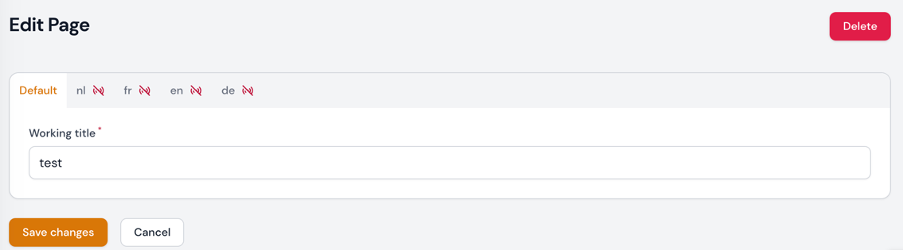
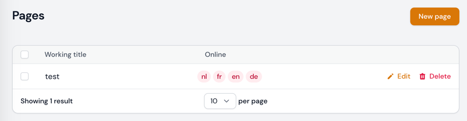

# Translatable Tabs for Filament

## Introduction

Adds a tab per locale and adds integration for [spatie/laravel-translatable](https://spatie.be/docs/laravel-translatable/v6/introduction) in Filament.



## Installation

You can install the package via composer:

```bash
composer require codedor/filament-translatable-tabs
```

> **Note**
> If you have not set up a custom theme and are using a Panel follow the instructions in the [Filament Docs](https://filamentphp.com/docs/3.x/panels/themes#creating-a-custom-theme) first. The following applies to both the Panels Package and the standalone Forms package.

1. Import the plugin's stylesheet (if not already included) into your theme's css file.

```css
@import '../../../../vendor/codedor/filament-translatable-tabs/resources/css/plugin.css';
```

2. Add the plugin's views to your `tailwind.config.js` file.

```js
content: [
    ...
    './vendor/codedor/filament-translatable-tabs/resources/**/*.blade.php',
]
```


## Getting started

Add the TranslatableTabs to your resource form:

```php
use Codedor\TranslatableTabs\Forms\TranslatableTabs;

public static function form(Form $form): Form
{
    return $form->schema([
        TranslatableTabs::make('Translations')
            ->defaultFields([
                TextInput::make('working_title')
                    ->required()
                    ->maxLength(255),
            ])
            ->translatableFields(function () {
                return [
                    TextInput::make("title")
                        ->label('Title')
                        ->required(fn (Closure $get) => $get("online")),
                        ->required(fn (Closure $get) => $get("online")),
    
                    Toggle::make("online")
                        ->label('Online'),
                ];
            })->columnSpan(['lg' => 2]),
    ]);
}
```

The default fields are the non-translatable fields and the translatable fields will be the fields that are also defined in the `$translatable` property on the model.

And add the `HasTranslations` trait to your pages with a form on (will be mostly Create and Edit):

```php
use Codedor\TranslatableTabs\Resources\Traits\HasTranslations;
```

This trait is necessary to save the translations together with your other fields. Since we have to manipulate the data after the form is submitted.

We also provide a column to display your locales in a Filament table.



```php
use Codedor\TranslatableTabs\Tables\LocalesColumn;

public static function table(Table $table): Table
{
    return $table
        ->columns([
            TextColumn::make('working_title'),
            LocalesColumn::make('online'),
        ])
        // ...
        ;
}
```

And also an entry for info lists.

```php
use Codedor\TranslatableTabs\InfoLists\TranslatableEntry;

TranslatableEntry::make([
    \Filament\Infolists\Components\TextEntry::make('title'),
    \Filament\Infolists\Components\TextEntry::make('slug'),
]);
```

By default, we will check the `LocaleCollection` facade, but you can also pass your own.

```php
use Codedor\TranslatableTabs\InfoLists\TranslatableEntry;

TranslatableEntry::make([
    \Filament\Infolists\Components\TextEntry::make('title'),
    \Filament\Infolists\Components\TextEntry::make('slug'),
], \App\CustomLocaleCollection::class);
```

### Adding extra tabs

You can add extra tabs by using the `->extraTabs()` method, this expects a Closure, array or `null`.
Passing an array here with Tabs will add them next to the general tab, this can be useful for separating your General tab in case it becomes too long.

```php
use Codedor\TranslatableTabs\Forms\TranslatableTabs;
use Filament\Forms\Components\Tabs\Tab;

public static function form(Form $form): Form
{
    return $form->schema([
        TranslatableTabs::make('Translations')
            ->defaultFields(...)
            ->extraFields([
                Tab::make('More options')->schema([
                    Text::make('Extra option')
                        ->required(), 
                ]),
            ])
            ->translatableFields(...)
            ->columnSpan(['lg' => 2]),
    ]);
}
```

### Showing a different icon

You can show a different icon by using the `icon()` method, this expects a Closure, string or `false`.
If `false` is returned, no icon will be shown. If a string or Closure is used it will expect a heroicon component, for example:

```php
\Codedor\TranslatableTabs\Forms\TranslatableTabs::make('translations')
    ->icon('heroicon-o-status-online');
```

Or when using a Closure:

```php
\Codedor\TranslatableTabs\Forms\TranslatableTabs::make('translations')
    ->icon(fn (string $locale, Closure $get) => $get("{$locale}.online") ? 'heroicon-o-status-online' : 'heroicon-o-status-offline');
```

### Passing the locales

For both fields you can pass the locales through a `locales()` method

```php
\Codedor\TranslatableTabs\Tables\LocalesColumn::make('online')
    ->locales(['en', 'nl']);
\Codedor\TranslatableTabs\Forms\TranslatableTabs::make('translations')
    ->locales(fn () => config('app.locales'));
```

It accepts an array or closure.

But, since Filament is so awesome you don't have to do this everywhere you use these in your project.
It can be defined once in a service provider:

```php
TranslatableTabs::configureUsing(function (TranslatableTabs $tabs) {
    $tabs->locales(['nl', 'en']);
});

LocalesColumn::configureUsing(function (LocalesColumn $column) {
    $column->locales(['nl', 'en']);
});
```

Read more about this behavior [here](https://filamentphp.com/docs/3.x/forms/fields/getting-started#global-settings).

## Actions

### CopyTranslationAction

This package provides an action to copy a locale to another locale.

To use it add it to your Edit page, e.g.:

```php
use Codedor\TranslatableTabs\Actions\CopyTranslationAction;
use Filament\Actions\DeleteAction;
use Filament\Resources\Pages\EditRecord;

class EditJobPage extends EditRecord
{
    // ...
    
    protected function getHeaderActions(): array
    {
        return [
            CopyTranslationAction::make(),
            DeleteAction::make(),
        ];
    }
    
    // ...
}
```

When clicked, this will open a modal and will then copy the data from the selected locale to the other locale.
